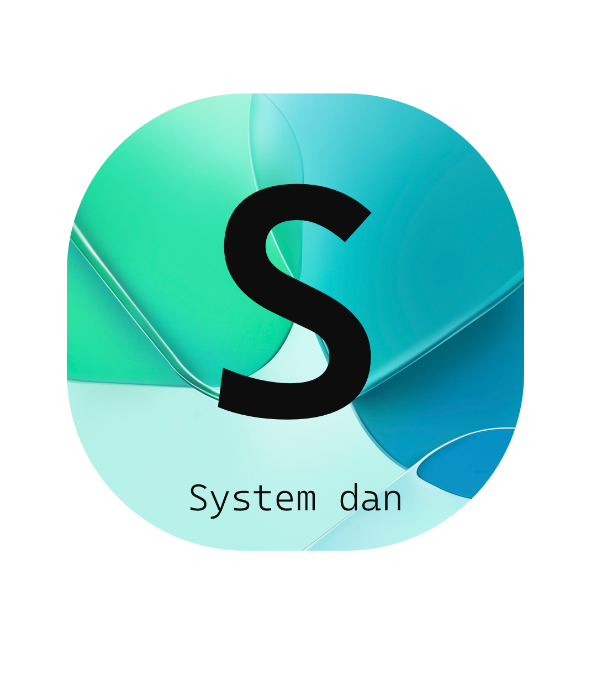

<h1 align="center">
<br>
SystemDan
</h1>

### systemdan is a collection of tools for system information.

<h2 align="center">
Commands
</h2>
    
for get information about the operating system; run this:

```bash
$ systemdan os
# OS: Windows
# release: 10
# architecture: AMD64
```

for get a list of all available commands, run this:

```bash
$ systemdan --help
# for get help about a specific command, run this:
$ systemdan os --help
```

<h2 align="center">
Todo
</h2>

- [ ] Add a command for getting the current date and time.
- [ ] Add graphical user interface.

<h2 align="center">
Contributing
</h2>

we will be happy to accept pull requests on github.
but beforce that, please read the [contributing guide](CONTRIBUTING.md).
